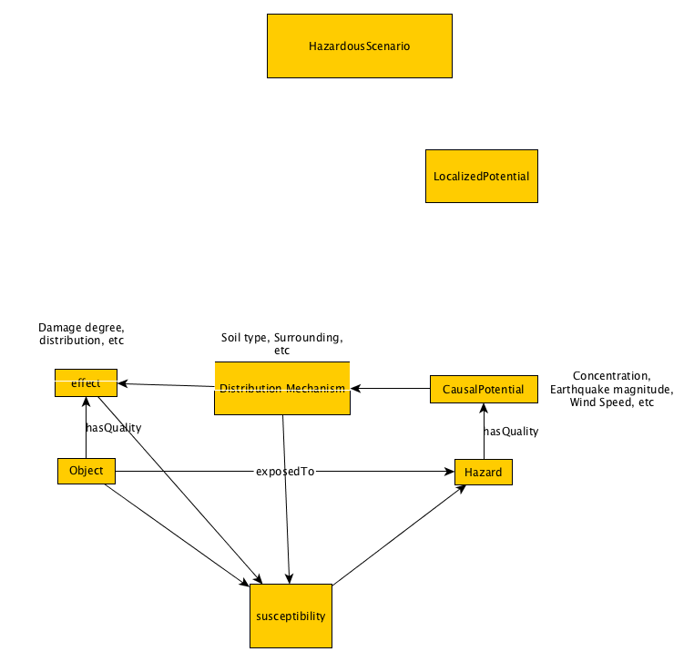

# Hazard Ontology Design Pattern
Description:
ODP extension of *HazardousSituation* that models *Hazard* as a cause-effect relationship between a *Hazard* and an *Object* which is exposed to a *Hazard*.

## Competency Questions

### Competency Questions for Natural Hazard related ODPs
- What Hazards (spike activities) These include wind, earthquake, exposure, other demand parameters, E-Design, Wind Tunnel Test Data also exists?
- At a certain location, what are the relevant earthquake spectrum effects?
- Given material, properties, thickness, curves, what probabilities for demand can it endure for a given set of conditions of climate hazard and use?

### Competency Questions for the ICS-related ODPs
- How many injuries occurred as a result of a particular hazardous situation?
- What is the set of distinct symptoms present in people involved in a particular hazardous situation?
- What hazards can cause those symptoms?
- Where (geographically) are the known hazards involved in a particular hazardous situation?
- When and where (geographically) did a particular injury?
- When and where did a particular hazardous situation occur?
- Which hazards are known to be connected to which injuries?
- How can a particular hazard be recognized (e.g. yellow powder, odorless liquid, etc.)?
- How should that hazard be handled (i.e. don’t touch it, don’t breath near it, etc.)?
- What level of exposure to a particular hazard will cause a particular injury?
- How long was a particular person exposed to a particular hazard?

## Axioms

### Syntactic Sugar
[//]: # (Hazard \sqsubseteq \top)
[//]: # (Object \sqsubseteq \top)
[//]: # (Susceptibility \sqsubseteq \top)
[//]: # (CausalPotential \sqsubseteq \top)
[//]: # (DistributionMechanism \sqsubseteq \top)
[//]: # (Effect \sqsubseteq \top)

[Original Axioms](http://mathurl.com/h8h3swq)

Note: We still need roles between (Object, Effect, DistributionMechanism, Hazard) and Susceptibility.
### Surface Semantics

### Deep Semantics
