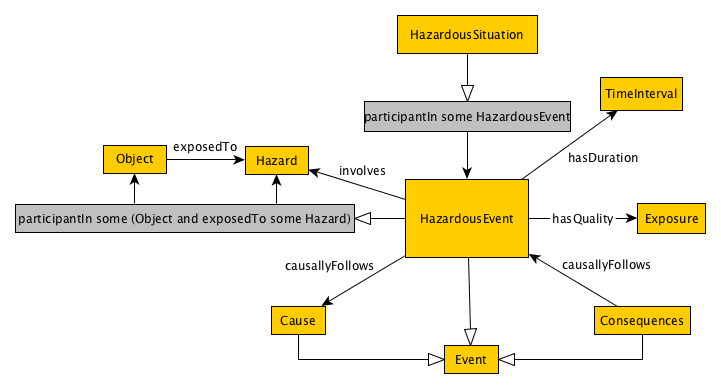

# HazardousSituation
Description: Original [WOP2015 submission](http://ceur-ws.org/Vol-1461/WOP2015_pattern_abstract_7.pdf) "The Hazardous Situation Ontology Design Pattern" by
Agnieszka Lawrynowicz and Ilona Lawniczak. Pattern documentation can be found at [ontologydesignpatterns.org](http://ontologydesignpatterns.org/wiki/Submissions:HazardousSituation)

## Competency Questions
The list of competency questions for the pattern is as follows:
- What object (person, organization, equipment etc.) is exposed to a hazard?
– To which hazard is exposed an object (person, organization, equipment etc.)?
– Which hazardous events are associated with a hazardous situation?
- What is the cause of a hazardous event?
- What is the consequence of a hazardous event?
- What is the value of exposure of an object being exposed to a hazard?

## Axioms
### [Original Axioms](http://mathurl.com/jml4unc)
[//]: # (\mathrm{HazardousSituation} &\sqsubseteq \exists \mathrm{participantIn}.\mathrm{HazardousEvent})
[//]: # (\mathrm{HazardousEvent} &\equiv \exists \mathrm{hasParticipant}.(\mathrm{Object}\sqcap \exists)
[//]: # (\mathrm{exposedTo.Hazard})
[//]: # (\mathrm{HazardousEvent} &\sqsubseteq \exists \mathrm{hasQuality.Exposure})
[//]: # (\mathrm{HazardousEvent} &\sqsubseteq \exists \mathrm{hasDuration.TimeInterval})
[//]: # (\mathrm{HazardousEvent} &\sqsubseteq \exists \mathrm{causallyFollows.Cause})
[//]: # (\mathrm{Consequence} &\sqsubseteq \exists \mathrm{causallyFollows.HazardousEvent})
[//]: # (\mathrm{Cause} &\sqsubseteq \mathrm{Event})
[//]: # (\mathrm{HazardousEvent} &\sqsubseteq \mathrm{Event})
[//]: # (\mathrm{Consequence} &\sqsubseteq \mathrm{Event}))

### New Axioms:
### [Syntactic Sugar](http://mathurl.com/gqupdc9)
[//]: # (\mathrm{Agent} \sqsubseteq \top)
[//]: # (\mathrm{Cause} \sqsubseteq \top)
[//]: # (\mathrm{Consequence} \sqsubseteq \top)
[//]: # (\mathrm{Event} \sqsubseteq \top)
[//]: # (\mathrm{Hazard} \sqsubseteq \top)
[//]: # (\matnrm{HazardousEvent} \sqsubseteq \top)
[//]: # (\mathrm{HazardousSituation} \sqsubseteq \top)
[//]: # (\mathrm{Exposure} \sqsubseteq \top)
[//]: # (\mathrm{DistributionMechanism} \sqsubseteq \top)
[//]: # (\mathrm{causallyFollows} &\sqsubseteq \emph{U})
[//]: # (\mathrm{causes} &\sqsubseteq \emph{U})
[//]: # (\mathrm{exposedTo} &\sqsubseteq \emph{U})
[//]: # (\mathrm{hasParticipant} &\sqsubseteq \emph{U})
[//]: # (\mathrm{causallyQuality} &\sqsubseteq \emph{U})
[//]: # (\mathrm{involves} &\sqsubseteq \emph{U})
[//]: # (\mathrm{isCausedBy} &\sqsubseteq \emph{U})
[//]: # (\mathrm{participantIn} &\sqsubseteq \emph{U})
[//]: # (Effect \sqsubseteq \top)

### [Deep Semantics](http://mathurl.com/hjxhlaf)
[//]: # (Disjoint relationships)
[//]: # (\mathrm{HazardousEvent} \sqcap \mathrm{Cause} \sqsubseteq \bot)
[//]: # (\mathrm{HazardousEvent} \sqcap \mathrm{Consequence} \sqsubseteq \bot)
[//]: # (\mathrm{HazardousEvent} \sqcap \mathrm{Agent} \sqsubseteq \bot)
[//]: # (\mathrm{Hazard} \sqcap \mathrm{Cause} \sqsubseteq \bot)
[//]: # (\mathrm{Hazard} \sqcap \mathrm{Consequence} \sqsubseteq \bot)
[//]: # (\mathrm{Hazard} \sqcap \mathrm{Exposure} \sqsubseteq \bot)
[//]: # (\mathrm{Hazard} \sqcap \mathrm{Event} \sqsubseteq \bot)
[//]: # (\mathrm{Exposure} \sqcap \mathrm{Cause} \sqsubseteq \bot)
[//]: # (\mathrm{Exposure} \sqcap \mathrm{Agent} \sqsubseteq \bot)
[//]: # (\mathrm{Exposure} \sqcap \mathrm{Consequence} \sqsubseteq \bot)
[//]: # (\mathrm{Exposure} \sqcap \mathrm{Event} \sqsubseteq \bot)
[//]: # (\mathrm{Event} \sqcap \mathrm{Agent} \sqsubseteq \bot)
[//]: # (\mathrm{Consequence} \sqcap \mathrm{Agent} \sqsubseteq \bot)
[//]: # (\mathrm{Cause} \sqcap \mathrm{Agent} \sqsubseteq \bot)
[//]: # (\mathrm{Cause} \sqcap \mathrm{HazardousSituation} \sqsubseteq \bot)

#### [Roles](http://mathurl.com/zptejtt)
[//]: # (\top &\sqsubseteq \forall\mathrm{exposedTo.Hazard}\\)
[//]: # (\exists \mathrm{exposedTo}.\top &\sqsubseteq \mathrm{Agent}\\)
[//]: # (\top &\sqsubseteq \forall\mathrm{hasParticipant.Agent}\\)
[//]: # (\exists \mathrm{hasParticipant}.\top &\sqsubseteq \mathrm{Event}\\)
[//]: # (\mathrm{hasParticipant} &\equiv \mathrm{participantIn}^- \\)
[//]: # (\top &\sqsubseteq \forall\mathrm{hasQuality.Exposure}\\)
[//]: # (\exists \mathrm{hasQuality}.\top &\sqsubseteq \mathrm{HazardousEvent}\\)
[//]: # (\top &\sqsubseteq \forall\mathrm{involves.Hazard}\\)
[//]: # (\exists \mathrm{involves}.\top &\sqsubseteq \mathrm{HazardousEvent}\\)
[//]: # (\top &\sqsubseteq \forall\mathrm{isCausedBy.Cause}\\)
[//]: # (\exists \mathrm{isCausedBy}.\top &\sqsubseteq \mathrm{Consequence}\\)
[//]: # (\mathrm{isCausedBy} &\equiv \mathrm{causes}^- \\)

